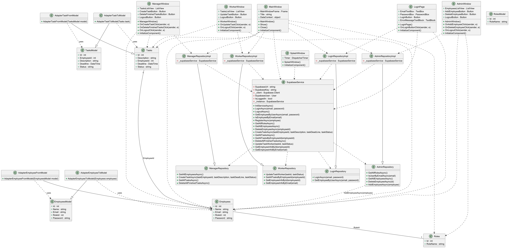
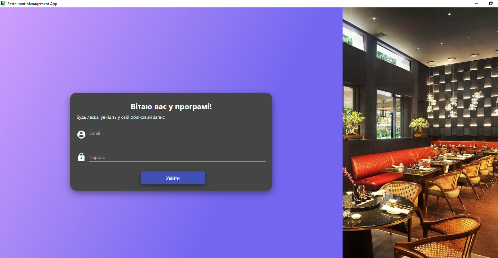
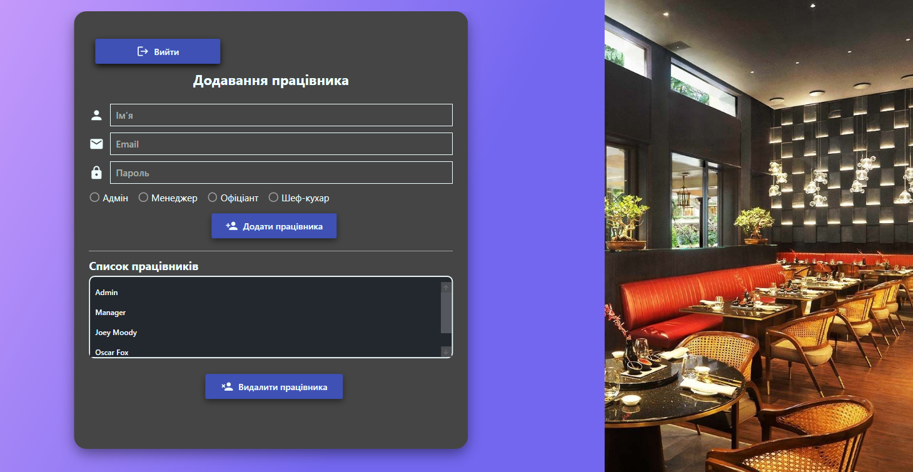
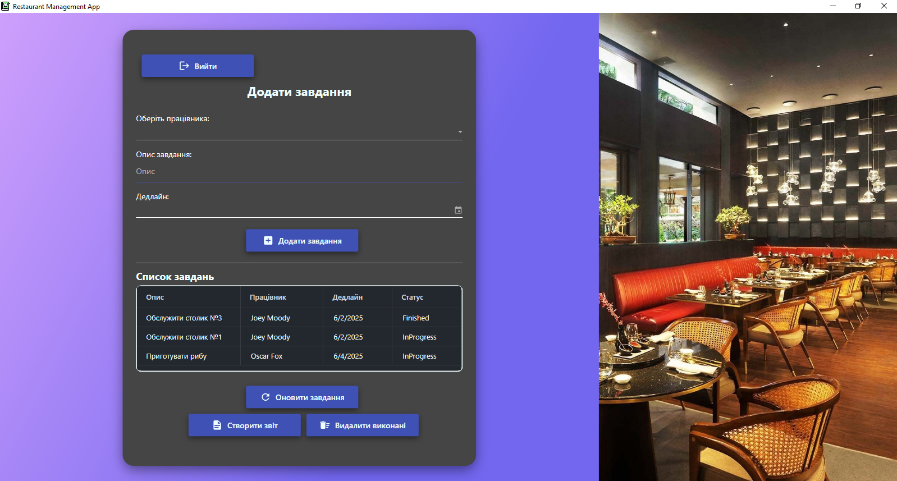
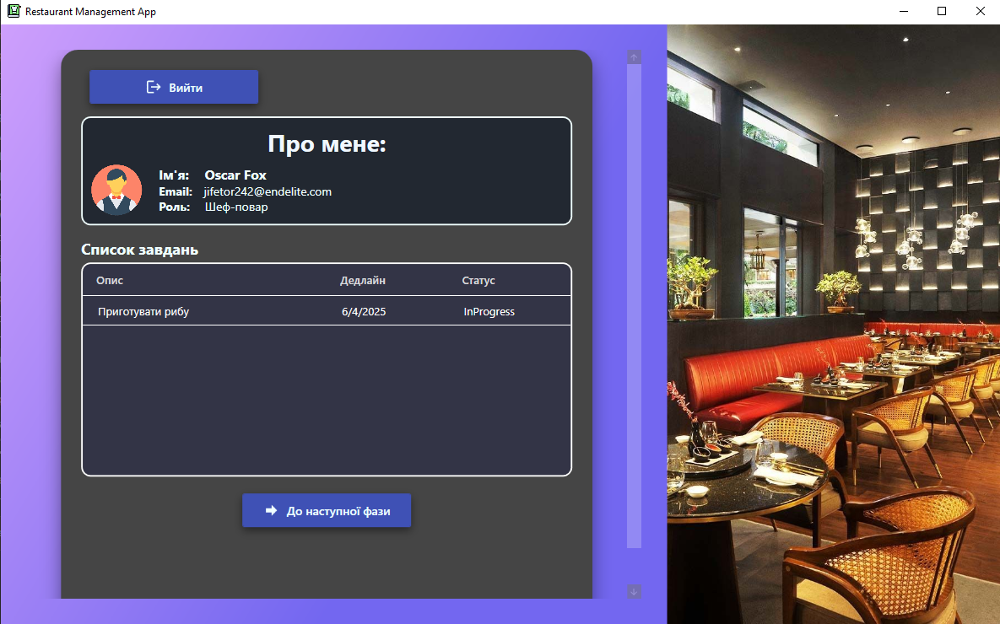

# Restaurant Personnel Management System

## Overview
This project is a comprehensive WPF-based restaurant personnel management system designed to automate staff management, task distribution, and performance analytics. The system provides different access levels for various roles including admin, waiters, cooks, and managers.

## Key Features

### 👥 Employee Management
- **Role-Based Access System**
  - Admin dashboard for complete system control
  - Manager interface for staff and task management
  - Worker interface for task visualization and updates
- **User Authentication**
  - Secure login system with email and password
  - Different access levels based on user roles
  - Session management for secure access

### 📋 Task Management
- **Task Assignment**
  - Managers can create and assign tasks to specific employees
  - Set task deadlines and priority levels
  - Track task status (pending, in progress, completed)
- **Real-Time Updates**
  - Workers can update task status in real-time
  - Instant task status visualization
  - Task history tracking

### 📊 Analytics & Reporting
- **Staff Management**
  - Employee registration and profile management
  - Staff turnover tracking
  - Role assignment and permissions management
- **Task Analytics**
  - Task completion rates monitoring
  - Deadline compliance tracking
  - Worker performance metrics

### 🎨 User Interface
- **Modern Design**
  - Material Design-based UI components
  - Responsive and intuitive interface
  - Custom icons and visual elements
- **User-Specific Dashboards**
  - Role-specific interfaces and features
  - Quick access to relevant information
  - Clean and organized layout

### 🔒 Security Features
- **Secure Authentication**
  - Integration with Supabase authentication
  - Password encryption
  - Session management
- **Access Control**
  - Role-based permissions
  - Secure data access
  - Activity logging

## Technology Stack
- **Frontend**: WPF (Windows Presentation Foundation)
- **UI Framework**: MaterialDesign
- **Backend**: .NET Core
- **Database**: Supabase
- **Testing**: Unit Tests with MSTest
- **Architecture**: MVVM Pattern

## Project Structure
```
CSharpFinalApp/           # Main WPF Application
├── Pages/                # UI Pages
│   ├── AdminPage        # Admin Dashboard
│   ├── ManagerPage      # Manager Interface
│   ├── WorkerPage       # Staff Interface
│   └── LoginPage        # Authentication
CSharpFinalCore/         # Business Logic Layer
├── Core/
│   ├── Entity/         # Domain Models
│   └── Repository/     # Data Access
CSharpFinalData/        # Data Access Layer
UnitTests/              # Test Suite
```

## Design Patterns Used
- **MVVM (Model-View-ViewModel)**: Core architectural pattern for separating the user interface from business logic
- **Singleton**: Used in SupabaseService for maintaining a single instance of database connection
- **Adapter**: Implements compatibility between different interfaces, particularly for external service integration

## System Architecture

### Class Diagram


### Prerequisites
- Visual Studio 2022 or JetBrains Rider
- .NET Core SDK 7.0 or later
- Supabase account and project setup

### Installation
1. Clone the repository
```bash
git clone [repository-url]
```
2. Open the solution in your IDE
3. Restore NuGet packages
4. Build and run the application

## User Roles
- **Admin**: Full system access, user management
- **Manager**: Staff management, task assignment, analytics
- **Worker**: Task view and status updates

## Default System Users
The system comes with pre-configured users for testing and initial setup:

### Admin
- Name: Admin
- Email: zoleksandr06@gmail.com
- Password: admin_pass
- Full system access and user management capabilities

### Manager
- Name: Manager
- Email: neyaso2429@ofular.com
- Password: manager_pass
- Access to staff management and task assignment

### Sample Staff
1. Waiter
   - Name: Joey Moody
   - Email: rzrmwth@tmpmailtor.com
   - Password: waiter_pass

2. Chef 1
   - Name: Oscar Fox
   - Email: jifetor242@endelite.com
   - Password: chef1_pass

3. Chef 2
   - Name: Cade Mann
   - Email: Takeysha.Perrett@AllFreeMail.net
   - Password: chef_pass

> Note: These are default testing accounts. It's recommended to change passwords in production environment.

## Screenshots

### Login Page


### Admin Dashboard


### Manager Interface


### Worker Interface


## License
This project is licensed under the MIT License - see the LICENSE.md file for details

## Contributing
1. Fork the Project
2. Create your Feature Branch
3. Commit your Changes
4. Push to the Branch
5. Open a Pull Request
